# 第14章 保护您的代码

2016 年，通讯服务 Kik (https://www.kik.com/) 与维护同名项目的开源贡献者 Azer Koçulu 之间关于 Kik 名称的争议导致互联网完全中断，至少那天每个人都注意到了不对劲。发生了什么？ 由于争议和 npm 支持 messenger 服务，Azer 从 npm 注册表中撤回了他的所有包。 在这些软件包中有一个名为 left-pad 的软件包，其目的是将字符添加到文本字符串的开头。left-pad 是一个只有 11 行代码的简单模块：

```
module.exports = leftpad;
function leftpad (str, len, ch) {
  str = String(str);
  var i = -1;
  if (!ch && ch !== 0) ch = ' ';
  len = len - str.length;
  while (++i < len) {
    str = ch + str;
  }
  return str;
}
```

这是一个简单的单一用途函数，每个开发人员都应该能够自己编写。 然而，该软件包使其成为全球使用的框架，例如 React。 当然，React 并不直接需要这 11 行代码。 但它依赖于依赖于其他包的包——而这棵树中的一个包依赖于 left-pad。 丢失的包裹基本上破坏了互联网（见 Keith Collins 2016 和 Tyler Eon 2016）。

今天的软件依赖于许多不同的软件——工具、包、框架、编译器和语言——每一个都有自己的依赖树。 不仅要确保代码的安全性和许可合规性，而且要确保整个软件供应链的安全性和许可合规性，这一点很重要。 

在本章中，您将了解 GitHub Actions 和 Advanced Security 如何帮助您消除代码中的错误和安全问题并成功管理您的软件供应链。

本章的关键主题如下：

- 依赖管理和 Dependabot
- 秘密扫描
- 扫码
- 编写自己的 CodeQL 查询


> GitHub 高级安全
> 
> 本章讨论的许多功能仅在您获得高级安全许可证后才可用于 GitHub Enterprise。 其中一些对于开源是免费的——但如果某些在您的组织中不可用，那么您可能还没有获得相应的许可证。

## 依赖管理和 Dependabot

要管理依赖项，您可以使用Software Composition Analysis (SCA) 工具。GitHub 提供依赖关系图、Dependabot 警报和 Dependabot 安全更新来管理您的软件依赖关系。

依赖关系图可帮助您了解依赖树。 Dependabot 警报会检查您的依赖项是否存在已知漏洞，并在Dependabot 发现任何漏洞时提醒您。 如果您启用 Dependabot 安全更新，如果依赖包的作者发布漏洞修复程序，Dependabot 将自动创建拉取请求来更新您的依赖项。

默认情况下，公共存储库启用依赖图，但私有存储库不启用。 必须为所有存储库启用 Dependabot 警报和更新。 您可以在 Settings|Security&Analysis（见图 14.1）：

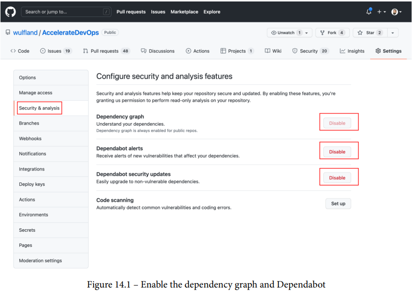

> 图 14.1 – 启用依赖图和 Dependabot

在组织级别，您可以为所有存储库启用这些选项，并将它们设为新存储库的默认值。

### 探索你的依赖

如果启用依赖关系图，它将开始寻找依赖关系。 支持以下包生态系统（见表 14.1）：

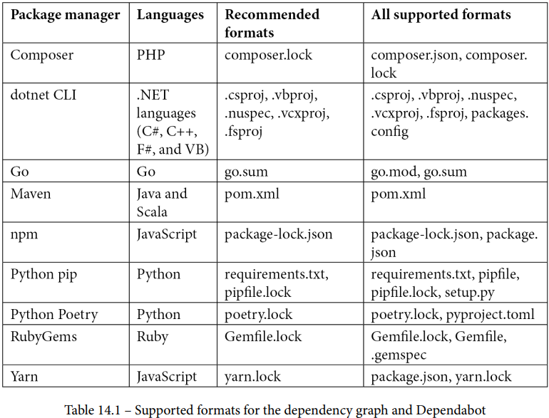

> 表14-1 依赖图和 Dependabot 支持的格式
>
> 程序包管理 程序语言 推荐格式 所有支持格式

要探索您的依赖项，您可以导航到 Insights|Dependency graph。 在 Dependencies 选项卡上，您可以找到在您的存储库中找到的清单文件的所有依赖项。 您可以打开每个依赖项的依赖项并导航树。 如果依赖项存在已知漏洞，您可以在右侧看到它。 该漏洞具有指定的严重性和常见漏洞和披露 (CVE) 标识符。 使用此标识符，您可以在国家漏洞数据库 (nvd.nist.gov) 中查找漏洞的详细信息。 单击该链接，它会将您定向到数据库中的条目 (https://nvd.nist.gov/vuln/detail/CVE-2021-3749) 或 GitHub 咨询数据库 (https://github.  com/咨询）。 如果漏洞有修复，依赖关系图会建议您应该将依赖关系升级到的版本（见图 14.2）：

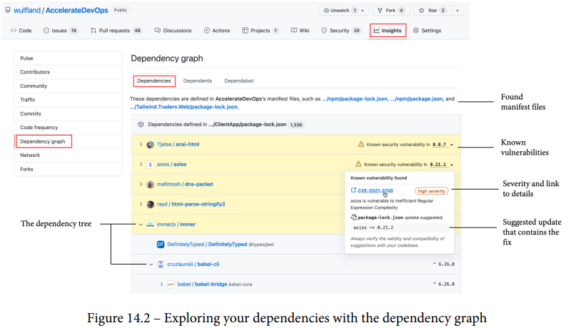

> 图14-2 使用依赖关系图探索依赖关系
>
>The dependency tree    依赖树
>
>Found manifest files    发现清单文件
>
>Known vulnerabilities    已知漏洞
>
>Severity and linkto details    严重性和链接到详细信息
>
>suggested update that contains the fix    包含修复的建议更新

在组织级别上，在 Insights|Dependencies 下，您可以从打开依赖关系图的所有存储库中找到所有依赖关系。除了存储库洞察，您还可以在这里找到所有使用过的许可证。这可以帮助您检查产品的许可证合规性（见图14.3）：

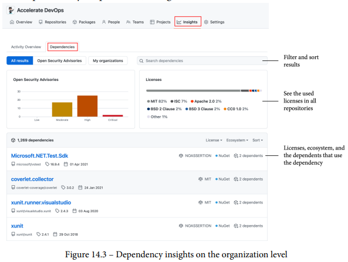

> 图14-3 组织级别的依赖性见解
>
>Filter and sort results    筛选和排序结果
>
>See the used licenses in all repositories    查看所有存储库中使用的许可证
>
>Licenses, ecosystem, and the dependents that use the dependency    许可证、生态系统和使用依赖项的依赖项

如果您想利用 GitHub 通知依赖您的软件包的其他人，您可以在Security|Security Advisories|New draft security advisory起草新的安全建议。安全顾问包含标题、描述、生态系统、包名称、受影响的版本（即 < 1.2.3）、修补版本 (1.2.3) 和严重性。 您可以选择添加多个常见弱点枚举器 (CWEs)（请参阅 https://cwe.mitre.org/）。 如果您已有 CVE ID，可以在此处添加，如果没有，您可以选择稍后添加。

在发布之前，草稿仅对存储库所有者可见。 发布后，公共存储库的安全建议对所有人可见，并添加到 GitHub 咨询数据库 (https://github.com/advisories)。 对于私有存储库，它们仅对有权访问该存储库的每个人可见，并且在您请求官方 CVE 标识符之前，它们不会被添加到咨询数据库中。

### Dependabot

Dependabot 是 GitHub 中的一个机器人，可以检查您的依赖项是否存在已知漏洞。 它还可以自动创建拉取请求以使您的依赖项保持最新。

Dependabot 支持 npm、GitHub Actions、Docker、git 子模块、.NET (NuGet)、pip、Terraform、Bundler、Maven 和许多其他生态系统。 有关完整列表，请参阅 https://docs.github.com/en/code-security/supply-chainsecurity/keeping-your-dependencies-updated-automatically/about-dependabot-version-updates#supported-repositories-andecosystems。

要启用 Dependabot，请在 .github 目录中创建一个 dependabot.yml 文件。 您选择包生态系统和包含包文件（即 package.json 文件）的目录。 您必须指定 Dependabot 应该每天、每周还是每月检查更新：

```
version: 2
updates:
  - package-ecosystem: "npm"
    directory: "/"
    schedule:
        interval: "daily"
```

您可以使用 Dependabot 秘密向私有注册表进行身份验证。 在 Settings | Secrets | Dependabot下添加一个新的 Dependabot 秘密（见图 14.4）：

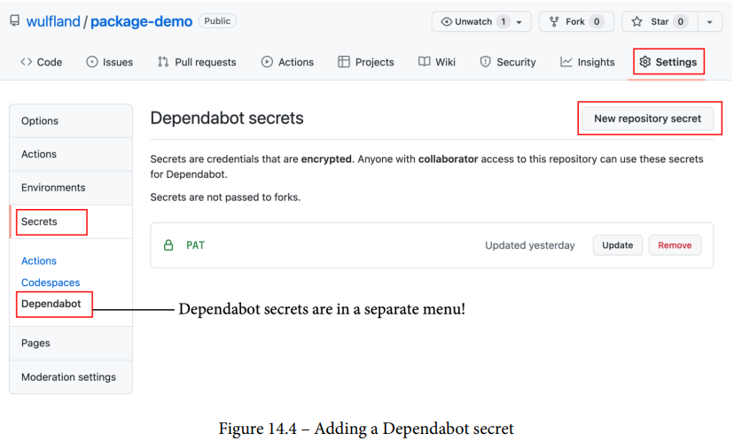

> 图14-4 添加一个 Dependabot 秘密
>
>Dependabot secrets are in a separate menu!    Dependabot 的秘密在单独的菜单中！

然后，将注册表添加到 dependabot.yml 文件并从秘密上下文访问秘密：

```
version: 2
registries:
  my-npm-pkg:
    type: npm-registry
    url: https://npm.pkg.github.com
    token: ${{secrets.PAT}}
updates:
  - package-ecosystem: "npm"
    directory: "/"
    registries:
        - my-npm-pkg
    schedule:
        interval: "daily"
```

配置 Dependabot 有更多选项——您可以允许或拒绝某些包，将元数据应用于拉取请求（例如标签、里程碑和审阅者），自定义提交消息，或者您可以更改合并策略。 有关选项的完整列表，请参阅 https://docs.github.com/en/code-security/supply-chain-security/keeping-your-dependencies-updatedautomatically/configuration-options-for-dependency-updates。

您可以在Insights | Dependency graph | Dependabot下查看 Dependabot 更新的状态。 如果出现问题，每个更新条目都有一行，其中包含状态和警告图标。 点击状态可以看到完整的日志（见图14.5）：

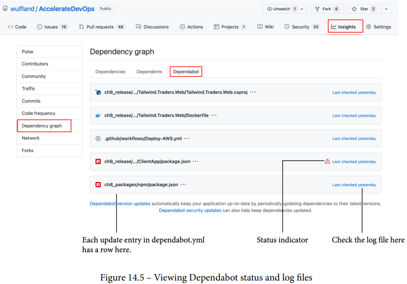

> 图14-5 查看 Dependabot 状态和日志文件
>
>Each update entry in dependabot.yml has a row here.    dependabot.yml 中的每个更新条目在这里都有一行。
>
>Status indicator    状态指示灯
>
>Check the log file here    在此处检查日志文件

您可以在Security | Dependabot alerts下找到所有 Dependabot 警报。您可以单击每个项目以查看详细信息。 如果 Dependabot 已经创建了一个修复漏洞的拉取请求，您可以在列表中看到一个带有弹出菜单的链接（见图 14.6）：


> 图14-6 查看 Dependabot 警报
>
>Click for details    点击查看更多细节
>
>Link to pull requests created    链接到已创建的拉取请求

请注意，此列表中仅包含安全警报——并非所有为更新您的依赖项而创建的拉取请求。 这里还有很多安全警报还没有修复。 有时，唯一的修复方法是降级，如果您的其中一位家属声明最低版本更高，则没有自动修复（见图 14.7）：

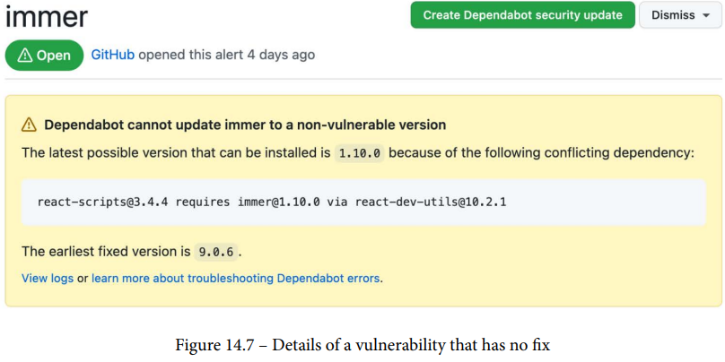

> 图14-7 没有修复的漏洞的详细信息

如果您仔细查看 Dependabot 的拉取请求，您会注意到很多附加信息。 当然，更改本身只是更新清单文件中的版本号。 但在描述中，它添加了包中的发行说明——如果有的话——以及新版本中提交的完整列表。  Dependabot 还添加了一个兼容性分数，表明此更新与您的代码兼容的可能性有多大（见图 14.8）：

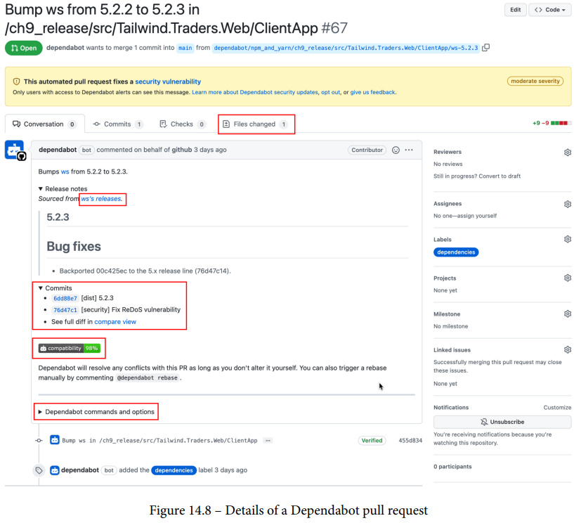

> 图14-8 Dependabot 拉取请求的详细信息

在描述中，您还将找到一个命令列表，您可以通过评论拉取请求将这些命令发送给机器人。 您可以使用以下任何命令：
- @dependabot cancel merge：取消先前请求的合并。
- @dependabot close：关闭拉取请求并防止 Dependabot 重新创建它。 您可以通过手动关闭拉取请求来获得相同的结果。
- @dependabot ignore this dependency: 关闭拉取请求并阻止 Dependabot 为此依赖项创建任何更多拉取请求（除非您重新打开拉取请求或自己升级到建议的依赖项版本）。
- @dependabot ignore this major version：关闭拉取请求并阻止 Dependabot 为这个主要版本创建任何更多的拉取请求（除非你重新打开拉取请求或自己升级到这个主要版本）。
- @dependabot ignore this minor version：关闭拉取请求并阻止 Dependabot 为该次要版本创建任何更多拉取请求（除非您重新打开拉取请求或自己升级到该次要版本）。
- @dependabot merge：一旦您的 CI 测试通过，就合并拉取请求。
- @dependabot rebase：重新设置拉取请求的基数。
- @dependabot recreate：重新创建拉取请求，覆盖对拉取请求所做的任何编辑。
- @dependabot reopen：如果拉取请求已关闭，则重新打开拉取请求。
- @dependabot squash and merge：一旦您的 CI 测试通过，压缩并合并拉取请求。

只需在拉取请求中评论其中一个命令，Dependabot 将为您完成剩下的工作。

### 使用 GitHub Actions 自动更新 Dependabot

您可以使用 GitHub Actions 为 Dependabot 更新添加更多自动化，但您必须注意一些事项。 如果 Dependabot 触发工作流，则 GitHub actor 是 Dependabot (github.actor == "Dependabot[bot]")。 这意味着 GITHUB_TOKEN 默认只有只读权限，必要时必须授予写入权限。 秘密上下文中填充的秘密是 Dependabot 秘密！GitHub Actions 机密不可用于工作流程。

以下是仅由 Dependabot 拉取请求触发并获得对拉取请求、问题和项目的写入权限的工作流示例：

```
name: Dependabot automation
on: pull_request
permissions:
  pull-requests: write
  issues: write
  repository-projects: write
jobs:
  Dependabot:
    runs-on: ubuntu-latest
    if: ${{ github.actor == 'Dependabot[bot]' }}
```

您可以使用 Dependabot/fetch-metadata 操作来提取有关正在更新的依赖项的信息。 下面是一个使用信息将标签应用于拉取请求的示例：

```
steps:
  - name: Dependabot metadata
    id: md
    uses: Dependabot/fetch-metadata@v1.1.1
    with:
      github-token: "${{ secrets.GITHUB_TOKEN }}"
  - name: Add label for production dependencies
    if: ${{ steps.md.outputs.dependency-type ==
'direct:production' }}
   run: gh pr edit "$PR_URL" --add-label "production"
   env:
     PR_URL: ${{ github.event.pull_request.html_url }}
```

使用 GitHub CLI，添加自动化非常容易。 例如，您可以自动批准和自动合并所有新补丁：

```
 -name: Enable auto-merge for Dependabot PRs 
    if: ${{ steps.md.outputs.update-type == 'version-
 update:semver-patch' }} 
    run: |
        gh pr review --approve "$PR_URL" 
        gh pr merge --auto --merge "$PR_URL" 
    env: 
        PR_URL: ${{github.event.pull_request.html_url}} 
        GITHUB_TOKEN: ${{ secrets.GITHUB_TOKEN }}
```

GitHub Actions 和 Dependabot 的结合非常强大，可以去除几乎所有的手动任务，让你的软件保持最新。 结合良好的 CI 构建和您信任的测试套件，您基本上可以自动合并所有通过测试的 Dependabot 拉取请求。

### 使用 Dependabot 使您的 GitHub 操作保持最新

您也必须管理GitHub 操作的依赖项。 每个操作都固定到一个版本（@后面的部分，例如使用：Dependabot/fetch-metadata@v1.1.1）。 版本也可以是分支名称——但这会导致工作流程不稳定，因为您的操作会在您不知情的情况下发生变化。 最好将版本固定到标签或单个提交 SHA。 与任何其他生态系统一样，您可以让 Dependabot 检查更新并为您创建拉取请求。 将以下部分添加到您的 Dependabot.yml 文件中：

```
version: 2 
updates: 
    - package-ecosystem: "github-actions" 
        directory: "/" 
        schedule: 
            interval: "daily"
```

如果您的操作有新版本可用，Dependabot 将创建拉取请求。

## 秘密扫描

最常见的攻击媒介之一是纯文本文件中的秘密。 绝不能在未加密和未受保护的情况下存储机密。  GitHub 通过不断扫描所有公共存储库的秘密来帮助您解决这个问题。 您还可以为属于启用了 GitHub 高级安全性的组织的私有存储库启用此功能。

目前，有近 100 个公开的秘密和 145 个私有存储库被检测到——Adobe、阿里巴巴、亚马逊、Atlassian、Azure 等等。 有关完整列表，请参阅 https://docs.github.com/en/code-security/secret-scanning/about-secret-scanning。

作为服务提供商，您可以注册秘密扫描合作伙伴计划（请参阅 https://docs.github.com/en/developers/overview/secretscanning-partner-program）。 您的秘密会被正则表达式检测到，然后被发送到端点，您可以在其中验证秘密是真实的还是误报。 撤销机密或仅通知客户机密已泄露是合作伙伴的决定。

您可以在设置 | 中为私有存储库启用秘密扫描。 安全与分析 |  GitHub 高级安全。 在这里，您还可以通过单击新建模式来定义自定义模式（见图 14.9）：

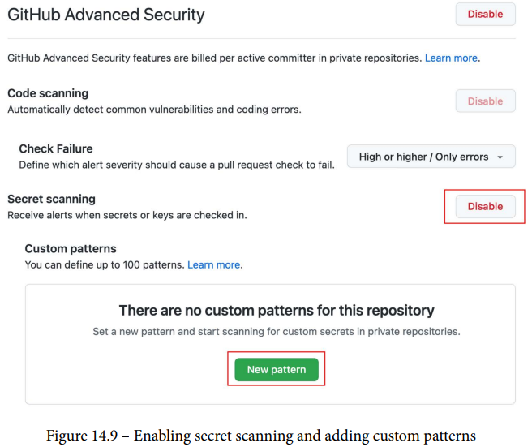

> 图14-9 启用秘密扫描并添加自定义模式

自定义模式是与您要检测的秘密相匹配的正则表达式。 您必须提供一些测试字符串以查看您的模式是否有效。  GitHub 将在测试字符串中找到的秘密标记为黄色（见图 14.10）：


> 图14-10 添加自定义秘密模式

您还可以自定义秘密前后的模式，您可以添加必须匹配或不得修补的模式——例如，您可以使用附加模式 ([A-Z]) 强制字符串必须至少包含一个大写字母 （见图 14.11）：

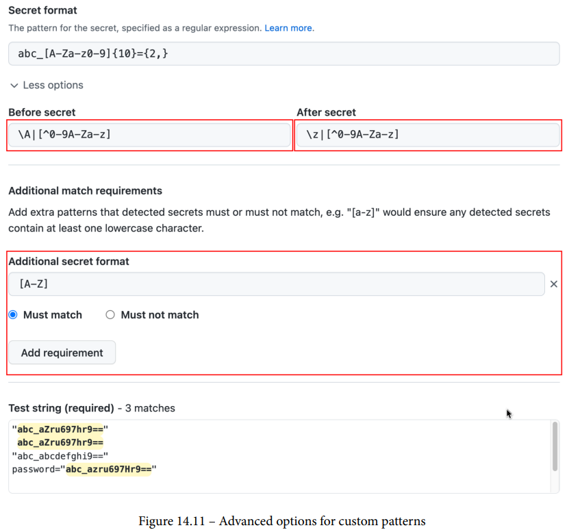

> 图14-11 自定义模式的高级选项

还可以在组织和企业级别定义自定义模式，GitHub 将在启用 GitHub Advanced Security 的情况下扫描企业或组织中的所有存储库。

当检测到新秘密时，GitHub 会根据通知首选项通知所有有权访问存储库安全警报的用户。 如果您正在查看存储库、启用了安全警报通知或存储库上的所有活动、是包含秘密的提交的作者并且没有忽略存储库，您将收到警报。

您可以在Security |Secret scanning alerts下管理警报（见图 14.12）：

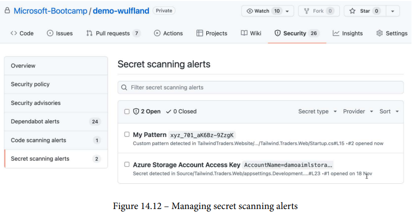

> 图14-12 管理秘密扫描警报

你应该考虑一个已经提交给 GitHub 的秘密被泄露——即使它只是一个私有存储库。 旋转并撤销秘密。 一些服务提供商会为您撤销它。

您可以关闭带有 Revoked、False positive、Used in tests 或 Won't fix 状态的警报（见图 14.13）：


> 图14-13 管理秘密扫描警报的状态

您还可以通过将 secret_scanning.yml 文件添加到 .github 文件夹来从秘密扫描中排除源代码中的路径。 该文件支持具有通配符支持的多路径模式：

```
paths-ignore: 
    - "tests/data/**/*.secret"
```

不过要小心！ 这不应该用于在源文件中存储真正的秘密，即使是用于测试——将秘密存储为 GitHub 加密的秘密或在安全的保险库中。

秘密扫描很简单——你基本上只需要打开它。 但不应低估安全的价值。

## 扫码

要查找您自己代码中的漏洞，您可以使用静态应用程序安全测试 (SAST)。 SAST 被认为是白盒测试，因为它可以完全访问源代码。 它不是纯粹的静态代码分析，因为它通常包括构建软件。 但与动态应用程序安全测试 (DAST) 不同——我们将在第 15 章保护你的部署中了解更多——它不是在运行时执行，而是在编译时执行。

### GitHub 中的代码扫描

在 GitHub 中，SAST 被称为代码扫描，它适用于所有公共仓库和启用了 GitHub Advanced Security 的私有仓库。 您可以将代码扫描与支持静态分析结果交换格式 (SARIF) 的所有工具结合使用。  SARIF 是一个基于 JSON 的 OASIS 标准，定义了静态分析工具的输出格式。  GitHub 代码扫描目前支持 SARIF 2.1.0，这是该标准的最新版本（见 https://docs.github.com/en/codesecurity/code-scanning/integrating-with-code-scanning/sarifsupport-for- 代码扫描）。 因此，任何支持 SARIF 2.1.0 的工具都可以集成到代码扫描中。

### 运行代码扫描

代码扫描使用 GitHub Actions 来执行分析。 大多数代码扫描工具会自动将结果上传到 GitHub——但如果您的代码扫描工具没有，您可以使用以下操作上传任何 SARIF 文件：

```
- name: Upload SARIF file
  uses: github/codeql-action/upload-sarif@v1
  with:
    sarif_file: results.sarif
```

该操作接受单个 .sarif（或 .sarif.json）文件或包含多个文件的文件夹。 如果您的扫描工具不支持 SARIF，这将很有用，但可以转换结果。 一个例子是 ESLint。 您可以使用@microsoft/eslintformatter-sarif 将输出转换为 SARIF 并上传结果：

```
jobs:
 build:
    runs-on: ubuntu-latest
    permissions:
    security-events: write
    steps:
        - uses: actions/checkout@v2
        - name: Run npm install
          run: npm install
        - name: Run ESLint
          run: node_modules/.bin/eslint build docs lib script
spec-main -f node_modules/@microsoft/eslint-formatter-sarif/
sarif.js -o results.sarif || true
    - uses: github/codeql-action/upload-sarif@v1
      with:
        sarif_file: results.sarif
```

但是，大多数代码扫描工具都原生集成到 GitHub 中。

### 入门

要开始使用代码扫描，请转到Settings | Security & analysis | Code scanning | Set up 或者 Security | Code scanning alerts。 两者都会将您带到 /security/codescanning/setup，其中会显示一个代码扫描选项列表。 在顶部，您可以看到原生的 GitHub 代码扫描工具——CodeQL Analysis。 但 GitHub 会分析您的存储库，并向您展示它可以在市场上找到的所有其他工具，这些工具适合在您的存储库中检测到的语言——42Crunch、Anchore、CxSAST、Ver aco de 等等。 在本书中，我们将重点关注 CodeQL——但其他工具的集成工作方式相同。 如果您单击Set up this workflow设置此工作流，GitHub 将为您创建一个工作流（见图 14.14）：


> 图14-14 设置扫码

如果您已经设置了代码扫描，则可以通过单击Add more scanning tools添加更多扫描工具从结果页面添加其他工具（见图 14.15）：

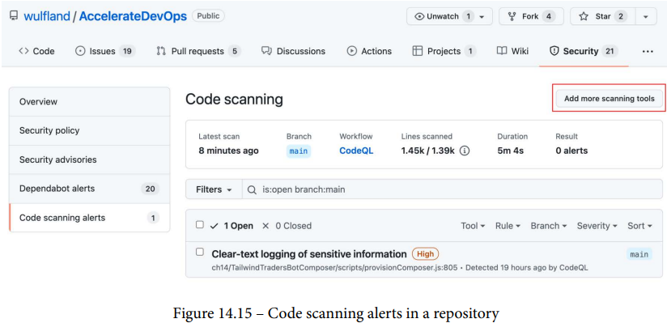

> 图14-15 存储库中的代码扫描警报

工作流模板具有用于推送、pull_request 和计划的触发器。 该时间表可能会让您感到惊讶，但它有一个简单的解释——可能有新的规则来检测您的代码库中以前未被识别的漏洞。 因此，最好也按计划运行构建。 触发器每周在随机的一天和随机的时间运行一次。 当然，GitHub 不希望所有代码扫描同时运行。 根据您的需要调整时间表：

```
on:
 push:
    branches: [ main ]
 pull_request:
    branches: [ main ]
 schedule:
    - cron: '42 16 * * 2'
```

工作流需要安全事件的写入权限：

```
jobs:
 analyze:
    name: Analyze
    runs-on: ubuntu-latest
    permissions:
        actions: read
        contents: read
        security-events: write
```

CodeQL 支持 C++ (cpp)、C# (csharp)、Go、Java、JavaScript、Python 和 Ruby。  GitHub 尝试检测存储库中使用的语言并设置矩阵，以便独立构建每种语言。 如有必要，添加其他语言：

```
strategy:
 fail-fast: false
 matrix:
    language: [ 'csharp', 'javascript' ]
```

分析本身非常简单——检查存储库，初始化给定语言的分析，运行自动构建，然后执行分析：

```
steps:
- name: Checkout repository
  uses: actions/checkout@v2
- name: Initialize CodeQL
  uses: github/codeql-action/init@v1
  with:
    languages: ${{ matrix.language }}
- name: Autobuild
  uses: github/codeql-action/autobuild@v1
- name: Perform CodeQL Analysis
  uses: github/codeql-action/analyze@v1
```

自动构建步骤会尝试构建您的源代码。 如果失败，您必须更改工作流程并自己构建代码。 有时，在环境中设置正确的版本就足够了——例如，Node.js 或 .NET 的版本：

```
- name: Setup Node
  uses: actions/setup-node@v2.5.0
  with:
    node-version: 10.16.3
```

### 扫码提醒

您可以在under Settings | Security & analysis | Code scanning 下的每个存储库中管理您的代码扫描警报，如图 14.15 所示。 在组织层面上，您可以获得所有存储库的概览，您可以跳转到各个结果页面（见图 14.16）：

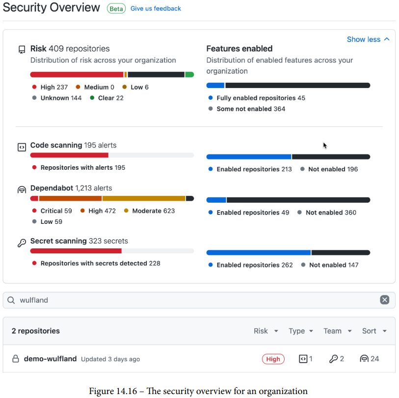

> 图14-16 组织的安全概述

您可以像处理问题一样过滤、排序和搜索警报。

#### 严重性

每个代码扫描警报都分配了严重性。 使用通用漏洞评分系统 (CVSS) 计算严重性。  CVSS 是一个开放框架，用于传达软件漏洞的特征和严重性（有关更多信息，请参阅 GitHub 博客 2021）。

严重性可帮助您对警报进行分类。

#### 跟踪问题中的警报

跟踪代码扫描警报的最佳方法是一个问题。 您可以通过单击警报中的创建问题来创建一个（见图 14.17）：


> 图14-17 从代码扫描警报创建问题

但它只是打开一个新问题并将警报的链接添加到 Markdown 任务列表中（见图 14.18）：


> 图14-18 将问题链接到代码扫描警报

警报将有一个指示器，表明它正在一个问题中被跟踪——就像嵌套问题一样（见下文的图 14.19）。

#### 数据流分析

在代码下方的区域中，您可以查看代码中警报的详细信息。  CodeQL 支持数据流分析，可以检测应用程序中数据流产生的问题。 单击 Show paths 查看数据如何流经您的应用程序（见图 14.19）：

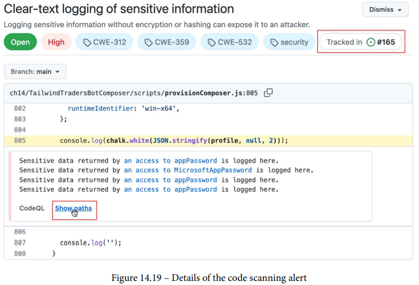

> 图14-19 扫码提醒详情

您可以在整个应用程序中跟踪数据。 在此处的示例中，您可以看到 12 个步骤，在这些步骤中，数据被分配和传递直到被记录（见图 14.20）：

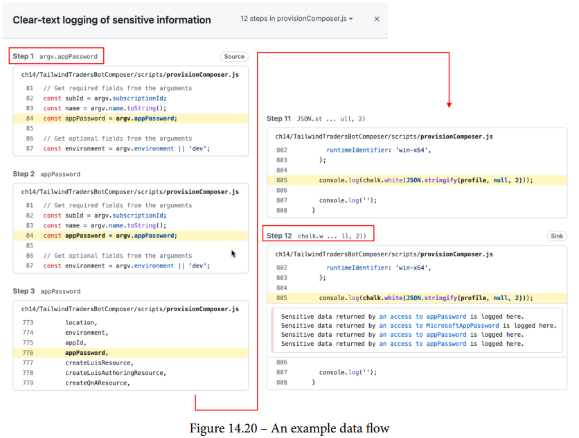

> 图14-20 示例数据流

这就是 CodeQL 的真正威力，它不仅仅是对源代码的语义分析。

#### 代码查询

在代码扫描警报中，您可以找到对检测到问题的查询的引用。 点击 View source 查看 GitHub 上的查询（见图 14.21）：

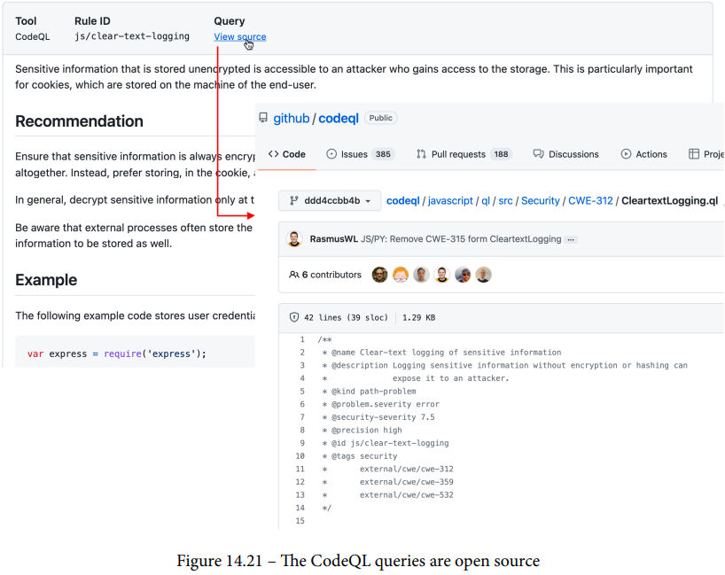

> 图14-21 开源的 CodeQL 查询

这些查询是开源的，您可以在 https://github.com/github/codeql 下找到它们。 每种语言在这里都有一个文件夹，在 CodeQL 文件夹中，您会在 ql/src 下找到查询。 查询具有 .ql 文件扩展名。

#### 时间线

代码扫描警报还包含一个具体的时间线，其中包含 git blame 信息，何时以及在什么提交中首次检测到问题？ 何时何地修复？ 又出现了吗？ 这可以帮助您对警报进行分类（见图 14.22）：

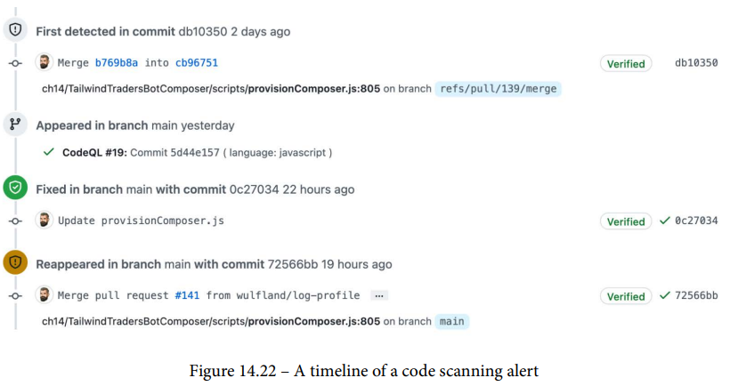

> 图14-22 代码扫描警报的时间轴

### 拉取请求集成

代码扫描与拉取请求集成得很好。 代码扫描结果集成到拉取请求检查中，详细信息页面显示结果概览（见图 14.23）：

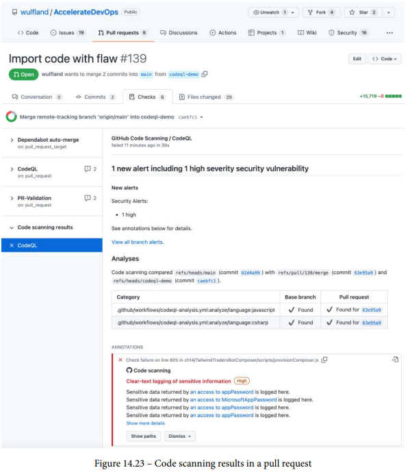

> 图14-23 代码扫描导致拉取请求

代码扫描还为代码中的警报添加注释，您可以直接在那里对发现进行分类，将状态更改为误报、用于测试或不会修复（见图 14.24）：

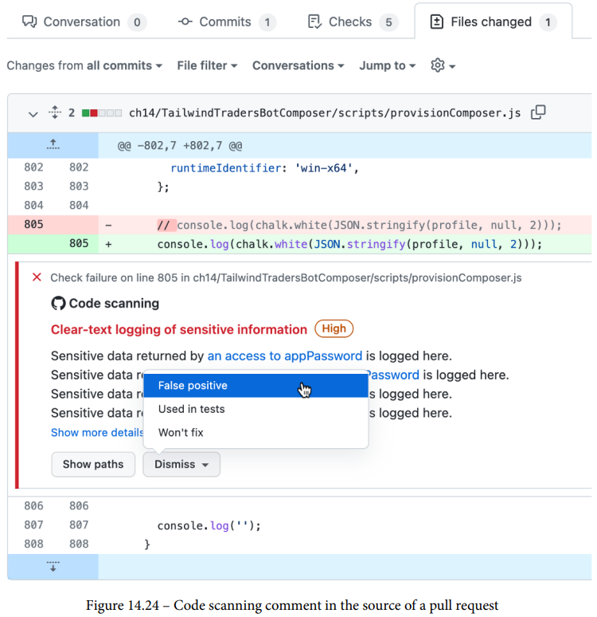

> 图14-24 拉取请求源中的代码扫描评论

您可以在 Settings | Security & analysis | Code scanning 下定义哪种警报严重性会导致拉取请求因安全问题和其他发现而失败（见图 14.25）：


> 图14-25 配置导致拉取请求失败的严重性级别

拉取请求集成可帮助您保持主分支清洁并在合并之前检测问题，并使代码分析成为审查过程的一部分。

### 扫码配置

配置代码扫描有很多选项。 工作流中的 init CodeQL 操作有一个名为查询的参数。 您可以使用它来选择一种默认查询套装：

- security-extended：更多严重性低于默认值的查询
- security-and-quality：来自安全扩展的查询，以及可维护性和可靠性查询

```
- name: Initialize CodeQL
  uses: github/codeql-action/init@v1
  with:
    languages: ${{ matrix.language }}
    queries: security-and-quality
```

您还可以使用查询参数来添加自定义查询。 该参数接受本地路径或对其他存储库的引用，包括 git 引用（分支、标记或 SHA）。 添加一个加号以在默认值之上添加查询：

```
with:
  queries: +.github/codeql/custom.ql,org/repo/query.ql@v1
```

CodeQL 包是基于 YAML 的查询套件，用于创建、共享、依赖和运行 CodeQL 查询。 可以使用 packs 参数设置它们：

```
with:
  packs: +.github/codeql/pack1.yml,org/repo/pack2.yml@v1
```


>重要的提示
>
>在撰写本文时，CodeQL 包仍处于测试阶段。 有关包的更多信息，请参阅 https://codeql.github.com/docs/codeql-cli/about-codeqlpacks/。

您还可以使用配置文件——例如，./.github/codeql/codeqlconfig.yml：

```
- uses: github/codeql-action/init@v1
  with:
    config-file: ./.github/codeql/codeql-config.yml
```

如果前面的任何内容位于另一个私有存储库中，那么您可以添加用于加载查询、包或配置文件的访问令牌：

```
    external-repository-token: ${{ secrets.ACCESS_TOKEN }}
```

在配置文件中，您通常禁用默认查询并指定您自己的查询。 您还可以排除特定路径。 这是一个例子——codeql-config.yml：

```
name: "Custom CodeQL Configuration"
disable-default-queries: true

queries:
  - uses: ./.github/codeql/custom-javascript.qls

paths-ignore:
  - '**/node_modules'
  - '**/test'
```

您的自定义查询套件 (custom-javascript.qls) 然后可以从 CodeQL 包 (codeqljavascript) 导入其他查询套件 (javascript-security-extended.qls) 并排除特定规则：

```
- description: "Custom JavaScript Suite"
- import: codeql-suites/javascript-security-extended.qls
  from: codeql-javascript
- exclude:
    id:
        - js/missing-rate-limiting
```

您还可以添加单个查询（-query：<查询路径>）、多个查询（-queries：<文件夹路径>）或包（-qlpack：<包名称>）。

CodeQL 非常强大，您有很多选项可以微调配置。 有关详细信息，请参阅 https://docs.github.com/en/code-security/code-scanning/automatically-scanning-your-code-for-vulnerabilities-anderrors/configuring-code-scanning。

## 编写自己的 CodeQL 查询

CodeQL 带有许多开箱即用的查询——尤其是当您使用安全和质量套件时。 但是，如果您开始编写自己的查询，CodeQL 的全部功能就会发挥出来。 当然，这不是微不足道的。  CodeQL 是一种复杂的查询语言，如果您查看 https://github.com/github/codeql 上的一些查询，您会发现它们可能会变得相当复杂。 但是，如果您了解自己的编码语言，那么创建一些简单的查询应该会很容易。

要编写 CodeQL 查询，您需要 Visual Studio Code (VS Code) 和 GitHub CodeQL 扩展 (https://marketplace.visualstudio.com/items?itemName=GitHub.vscode-codeql)。

如果两者都安装了，请克隆起始工作区：

```
$ git clone --recursive https://github.com/github/vscodecodeql-starter.git
```

注意 --recursive 参数！ 如果忘记了，则必须手动加载子模块：

```
$ git submodule update --remote
```

在 VSCode 中，选择File | Open Workspace from File…，然后从入门工作区中选择 vscode-codeqlstarter.code-workspace 文件。

要从源代码创建数据库，您需要 CodeQL CLI。 在 Mac 上，您可以使用 Homebrew 安装它：

```
$ brew install codeql
```

对于其他平台，您可以在此处下载二进制文件：https://github.com/github/codeql-cli-binaries/releases/latest。

将它们提取到一个文件夹并将它们添加到 $PATH 变量（在 Windows 上为 %PATH%）。

现在，进入要存储数据库的文件夹并运行以下命令：

```
$ codeql database create <database name> \
  --language=<language> \
  --source-root=<path to source code>
```

这将为您的存储库中的语言创建一个数据库。 对存储库中的所有语言重复该步骤。

现在，在 VSCode 中打开 QL 扩展并单击 Databases | 从一个文件夹。 选择您在上一步中创建的数据库。 您可以附加多个数据库并在它们之间切换（见图 14.26）：

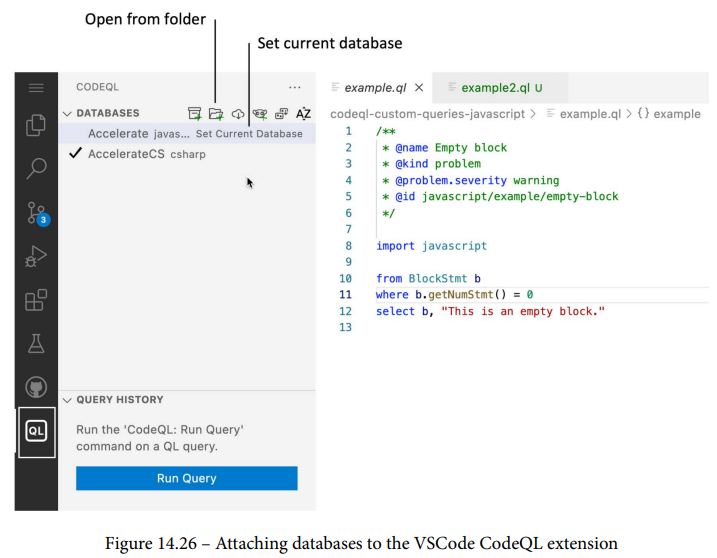

> 图14-26 将数据库附加到 VSCode CodeQL 扩展

您可以在入门工作区 (codeql-custom-queries-<language>/example.ql) 中找到所有受支持语言的示例查询。 查询有一个带有元数据的评论标题：

```
/**
 * @name Empty block
 * @kind problem
 * @problem.severity warning
 * @id javascript/example/empty-block
 */ 
```

然后，他们导入必要的模块。 它们通常以语言命名（javascript、csharp、java 等），但它们也可以类似于 DataFlow::PathGraph：

```
import javascript
```
查询本身有一个变量声明，一个可选的用于限制结果的 where 块，以及 select 语句：

```
from BlockStmt b
where
  b.getNumStmt() = 0
select b, "This is an empty block."
```

查看 GitHub 上的 CodeQL 示例以了解如何开始。 您对一种语言了解得越多，编写查询就越容易。 以下查询将在 C# 中搜索空的 catch 块：

```
import csharp

from CatchClause cc
where
  cc.getBlock().isEmpty()
select cc, "Poor error handling: empty catch block."
```

您在 VSCode 中拥有完整的 IntelliSense 支持（见图 14.27），这在编写查询时有很大帮助：

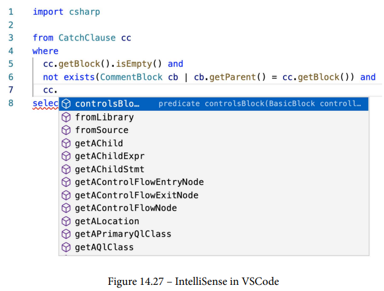

> 图14-27 VSCode 中的智能感知


如果您从上下文菜单运行查询（CodeQL：运行查询），它将在结果窗口中显示结果（见图 14.28）：

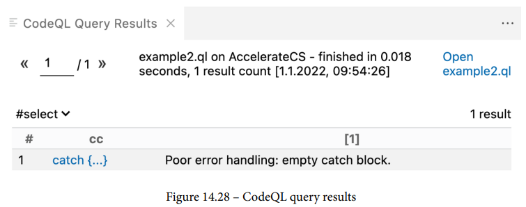

> 图14-28 CodeQL查询结果

select 子句中的每个元素都有一列。 您可以单击代码元素，VSCode 将在确切位置打开相应的源文件。

关于 CodeQL，您可以轻松地写满一整本书。 这只是一个非常简短的介绍，但我看到了能够使用您自己的规则扩展代码扫描的很多价值。

有关详细信息，请参阅 CodeQL 文档和语言参考。

## 总结

在本章中，您学习了如何保护代码和控制依赖项：

- 您已经了解了 SCA，并且知道如何使用依赖关系图、Dependabot 警报和 Dependabot 安全更新来管理您的软件依赖关系。
- 您已经了解了秘密扫描，它可以防止秘密在您的源代码中泄露。
- 您已经了解了 SAST，并且知道如何通过 CodeQL 或其他支持 SARIF 的工具使用代码扫描来发现开发过程中的问题。 您现在可以编写自己的查询来执行质量和编码标准。

在下一章中，我们将研究如何保护我们的发布流水线和部署。

## 拓展阅读

这些是本章中的参考资料，您还可以使用它们来获取有关这些主题的更多信息：

- How one programmer broke the internet by deleting a tiny piece of code, Keith Collins (2016): https://qz.com/646467/how-one-programmer-broke-theinternet-by-deleting-a-tiny-piece-of-code/
- Kik, Left-Pad, and NPM – Oh My!, Tyler Eon (2016): https://medium.com/@kolorahl/kik-left-pad-and-npm-oh-my-e6f216a22766
- Secure at every step: What is software supply chain security and why does it matter?,Maya Kaczorowski (2020): https://github.blog/2020-09-02-secureyour-software-supply-chain-and-protect-against-supplychain-threats-github-blog/
- About the dependency graph: https://docs.github.com/en/codesecurity/supply-chain-security/understanding-yoursoftware-supply-chain/about-the-dependency-graph
- About Dependabot version updates: https://docs.github.com/en/codesecurity/supply-chain-security/keeping-your-dependenciesupdated-automaticallyabout-Dependabot-version-updates
- About secret scanning: https://docs.github.com/en/code-security/secret-scanning/about-secret-scanning
- About GitHub Advanced Security: https://docs.github.com/en/get-started/learning-about-github/about-github-advancedsecurity
- About code scanning: https://docs.github.com/en/code-security/code-scanning/automatically-scanning-your-code-forvulnerabilities-and-errors/about-code-scanning
- CodeQL code scanning: new severity levels for security alerts, GitHub Blog (2021):https://github.blog/changelog/2021-07-19-codeql-codescanning-new-severity-levels-for-security-alerts/
- Common Vulnerability Scoring System (CVSS): https://www.first.org/cvss/v3.1/specification-document
- CodeQL documentation: https://codeql.github.com/docs/
- QL language reference: https://codeql.github.com/docs/ql-language-reference