# GitHub - 开发者的家园
本章节将解释GitHub平台的一些基础知识。从中可以了解有关不同托管选项、价格和如何将其集成到现有工具链中。  

主要主题如下：

- 托管选项与价格
- GitHub Connect
- 实践-在GitHub.com创建您的帐户
- 企业安全 
- GitHub学习实验室

## 托管选项与价格

GitHub 有很多不同的许可证和托管选项，对于企业来说，了解它们以做出正确的选择非常重要。

### 托管选项

GitHub（https://github.com）的托管地点在美国的数据中心。您可以免费在 GitHub 注册，并获得免费的无限私有和公共存储库。GitHub 的许多功能对于开源项目是免费的，但不适用于私有存储库。   
对于企业来说，有不同的选项来托管 GitHub（请参见图 20.1）：

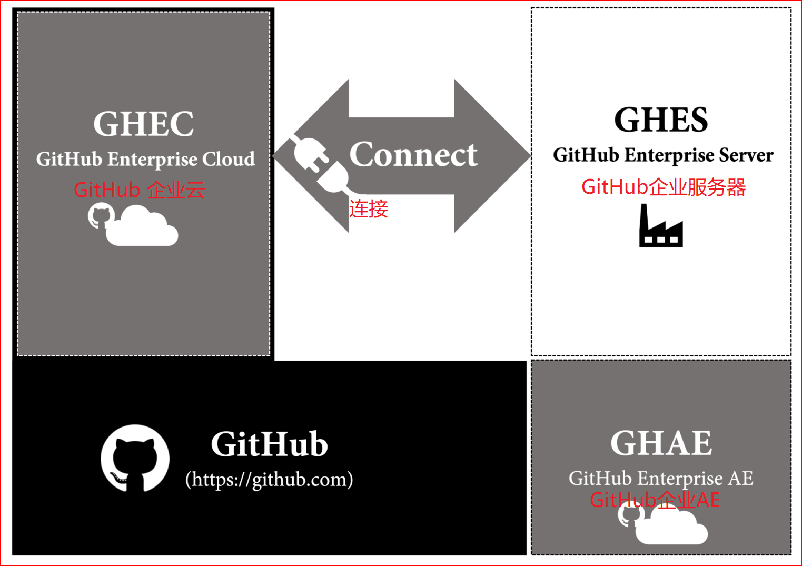

图20.1 – GitHub企业版托管选项   

#### GitHub企业云
GitHub 企业云 （GHEC）是由 GitHub 提供的 SaaS 服务，完全由 GitHub 在美国的云基础设施托管。其可以为用户提供更高的安全性和支持单点登录，同时允许用户在企业背景下托管私有和公共存储库，进行开源项目的托管。 
GHEC 保证企业每个月的SLA可用性为 99.9%，即每个月最多只会有 45 分钟的停机时间。 

#### GitHub企业服务器
GitHub Enterprise Server（GHES）是一个可以在任何地方托管的系统。您可以将其托管在自己的数据中心或云环境中，例如Azure或AWS。您可以使用GitHub Connect连接到GitHub.com，这样您就可以共享许可证并利用服务器上的开源资源。 

GHES基于与GHEC相同的源代码，因此所有功能最终都将在几个月后到达服务器。但是在云中提供的一些内容在GHES上您必须自行处理，例如GitHub Actions中的runners。在云中，您可以利用GitHub托管的runners；在GHES上，您必须使用自托管的runners构建自己的解决方案。  

也有托管服务可以为您托管GHES，例如在您所在地区的Azure数据中心。这样，您就可以拥有完整的数据驻留，不需要自己管理服务器。其中一些托管服务还包含提供托管GitHub Actions runners的选项。 

#### GitHub企业AE
GitHub正在开发一项名为GitHub Enterprise AE (GHAE) 的服务。目前仅对拥有500个以上用户席位的客户进行私有测试，目前尚未确定该服务的公开推出日期。  

GHAE是GitHub在用户选择的Microsoft Azure区域内提供的一项完全隔离的、由GitHub管理的服务。这可以为用户提供完整的数据驻留地和合规性。 对于需要数据驻留和合规性的客户来说，这将是未来的一个不错的选择，但目前尚不清楚其可用日期、价格和最低用户数量。

### GitHub连接

GitHub的重要性在于其社区以及社区所提供的价值。要在服务器上利用这些优势，可以使用GitHub Connect将服务器连接到GitHub。用户可以逐个激活每个功能，如图20.2所示：

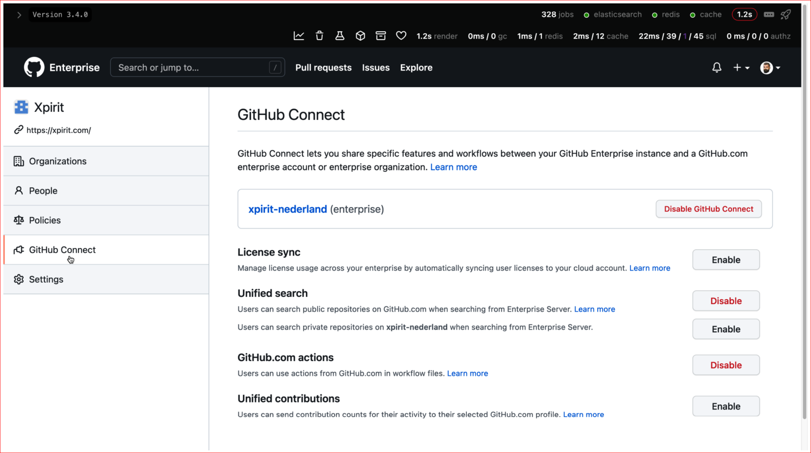

图20.2 - GHES中的GitHub Connect配置   

以下是功能列表：  
- 许可证同步：管理企业范围内多个服务器或组织的许可证使用情况。这有助于确保无论在哪里登录，一个用户只使用一个许可证。
- 统一搜索：一种选择是允许在服务器上搜索，并从GitHub.com获得公共存储库的结果。此外，可以允许在服务器上搜索，并找到属于您的企业的私有仓库（仅当用户具有对存储库的访问权限时）。
- GitHub.com actions：若要在工作流中加载公共actions，必须启用此选项。如果没有此选项，必须将所有actions复制到服务器，并从那里引用它们。用户仍然可以在组织级别配置允许的actions。
- 统一贡献：如果没有此选项，用户在服务器上的贡献不会显示在其公共个人资料中。此选项不暴露敏感数据，仅发送对GitHub.com的贡献数（如提交、问题、讨论或拉取请求）。

### 价格

GitHub 的价格按用户每月计费，分为三个不同的层级：免费版、团队版和企业版（见图 20.3）。  

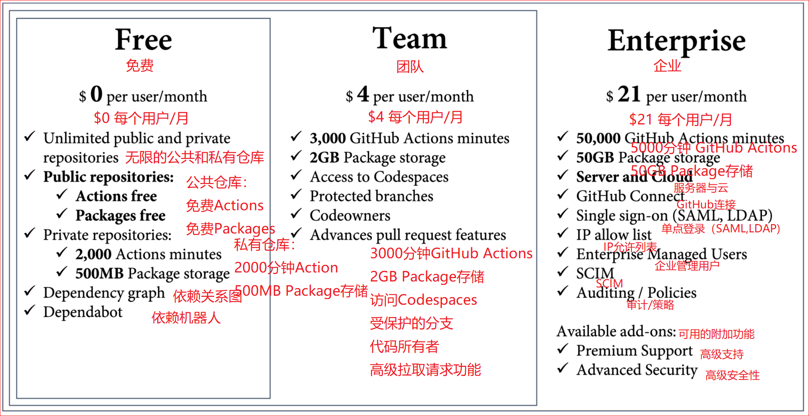

图20.3 – GitHub价格层次概览  

公共仓库（也就是开源）是免费的，包含许多免费功能，如 Actions、Packages 和许多安全功能。私有仓库部分功能免费，每月有 2,000 分钟的 Actions 时限和 500 MB 的存储。第7章详细介绍了Actions的定价。   

如果您想在私有仓库中与 GitHub 协作，您至少需要团队许可证。其包括受保护的分支、代码所有者和其他高级拉取请求功能。您可以访问 Codespaces，但必须单独支付费用（关于 Codespaces 的定价，请参见第 13 章：向左移动安全性和 DevSecOps）。团队版包含 3,000 分钟的 Actions 和 2 GB 的存储（用于包）。   

免费版和团队版只在GitHub.com上可用。如果需要GHEC、GHES或GHAE，必须购买GitHub Enterprise许可证。此许可证包含所有企业版功能，例如单点登录、用户管理、审核和策略，并提供50,000个Action分钟和50 GB的包存储。并附带 50,000 分钟 的Action 和 50 GB 包存储。此外，还可以选择购买额外的附加组件，例如高级安全性或高级支持。   

许可证以 10 个块的形式购买，可以按月或按年付款。如果要使用 GitHub Advances Security 或 Premium Support，必须与 GitHub 销售团队或 GitHub 合作伙伴联系，他们可以提供报价。    

除许可证层次外，还有一些按使用次数收费的内容，如以下项目：    

- Actions
- Packages
- Codespaces
- Marketplace 按次使用的应用  

您可以在组织或企业级别配置支出限制


## 实践——在GitHub.com上创建您的帐户
假设目前你已经有了 GitHub 账户。由于超过 7000 万用户的加入，你很有可能已经拥有一个账户。如果你已经有了，可以跳过本节，继续学习企业安全。  

创建 GitHub 账户非常简单，它的设计类似于一个向导，看起来像一个控制台，具体步骤如下：  

1. 访问 https://github.com，点击"Sign up"。  

2. 输入你的电子邮件地址，点击"Continue"或按Enter，如图20.4所示：

    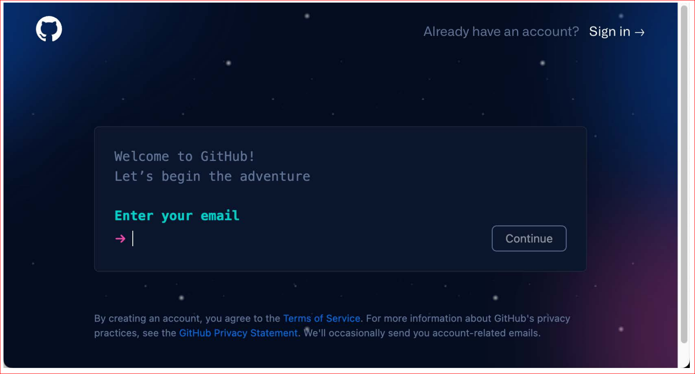

  图20.4 - 输入您的电子邮件地址

3. 请输入一个强密码，然后单击“Continue”。 

4. 输入用户名。用户名必须是唯一的。 GitHub 会告诉您您的名字是否可用，如图20.5所示：

    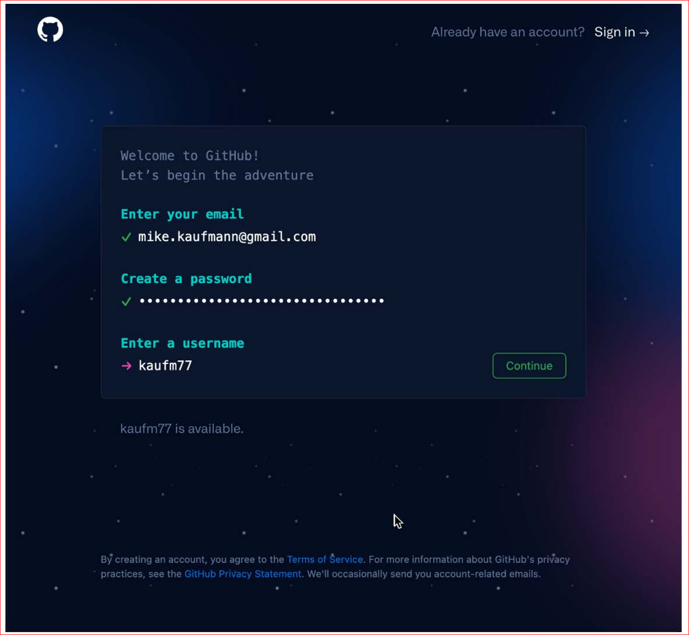

  图 20.5 - 创建密码并挑选一个唯一的用户名  

  如果你找到了一个唯一的用户名，请点击“continue”。    

5. 现在，您可以选是否接收电子邮件通信。键入 y 表示是，键入 n 表示否，然后单击 Continue 或点击Enter。

6. 通过点击图像中指定部分来完成验证码。请注意，验证码可能会根据您浏览器的首选语言显示（参见图20.6）  

    

  图20.6 – 电子邮件通信和验证码

7. 现在，请检查您的电子邮件账户。您应该已经收到了一个验证码，您可以将其粘贴到以下区域中（请参见图 20.7）

    

  图20.7 - 输入发送到您电子邮件地址的验证码

8. 接下来的对话是为了让您的体验更个性化，你可以跳过它们。

9. 您可以选择 GitHub Enterprise 的免费 30 天试用版，这应该足够您试用所有的功能。

成功创建了您的账户后，接着进行以下步骤：   
1. 访问https://github.com/settings/security启用双重身份验证以保护你的账户。
2. 在https://github.com/settings/profile填写您的个人资料并选择一个合适的头像。
3. 在https://github.com/settings/appearance选择您喜欢的主题。您可以选择单一的浅色或深色主题，也可以选择与系统同步主题。
4. 在https://github.com/settings/emails选择如何处理您的电子邮件地址。您可以选择保持您的电子邮件地址私密。GitHub 将使用特殊的电子邮件地址执行基于网络的 Git 操作。该地址的格式如下：<user-id> + <user-name>@users.noreply.github.com。如果您想阻止包含真实电子邮件地址的命令行推送，则必须在本地配置此地址：
  ```shell
  $ git config --global user.email <email address>;  
  ```

现在，您的 GitHub 账户已经准备好了，您可以开始创建仓库或参与开源项目。  

## 企业安全
作为企业，您可以使用您的身份提供者（IdP）来SAML单点登录（SSO），以保护您的GitHub Enterprise资源。
SSO可以在GHEC中以企业和组织级别配置，但在GHES中仅能在整个服务器配置。   

SAML SSO可以与所有支持SAML的IdP配置，但并不能与所有支持跨域身份管理（SCIM）的IdP配置。与SAML SSO兼容的有Azure AD（AAD），Okta和OneLogin。

### SAML 认证

在GitHub中配置SAML SSO非常简单。您可以在企业或组织设置中的认证安全（/settings/security）| SAML单点登录下找到相应的设置。在这里，您可以找到配置IdP所需的消费者URL（见图20.8）：

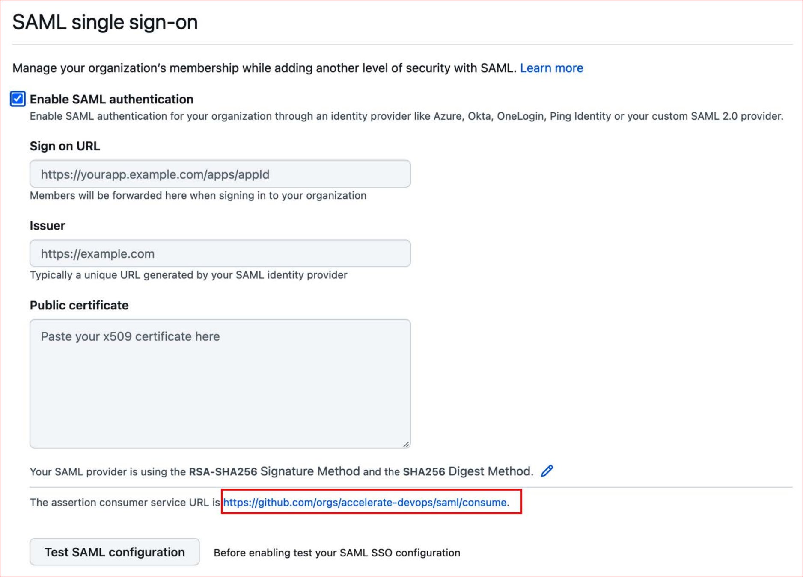

图20.8 - 在GitHub中配置SAML SSO

必须在您的 IdP 中配置此字段的值。有关更多信息，请查看其文档。以AAD为例，您可以在此处找到详细的说明：https://docs.microsoft.com/en-us/azure/active-directory/saas-apps/github-tutorial。您必须在AAD中创建一个新的企业应用程序。你可以搜索GitHub的模板并挑选相应的模板（针对企业、组织或服务器）。目前可用的模板参见图 20.9：


图20.9 - AAD中的GitHub企业应用模板

分配用户或组到您想访问的GitHub应用程序。重要的配置在设置单点登录中进行（参见图20.10）：

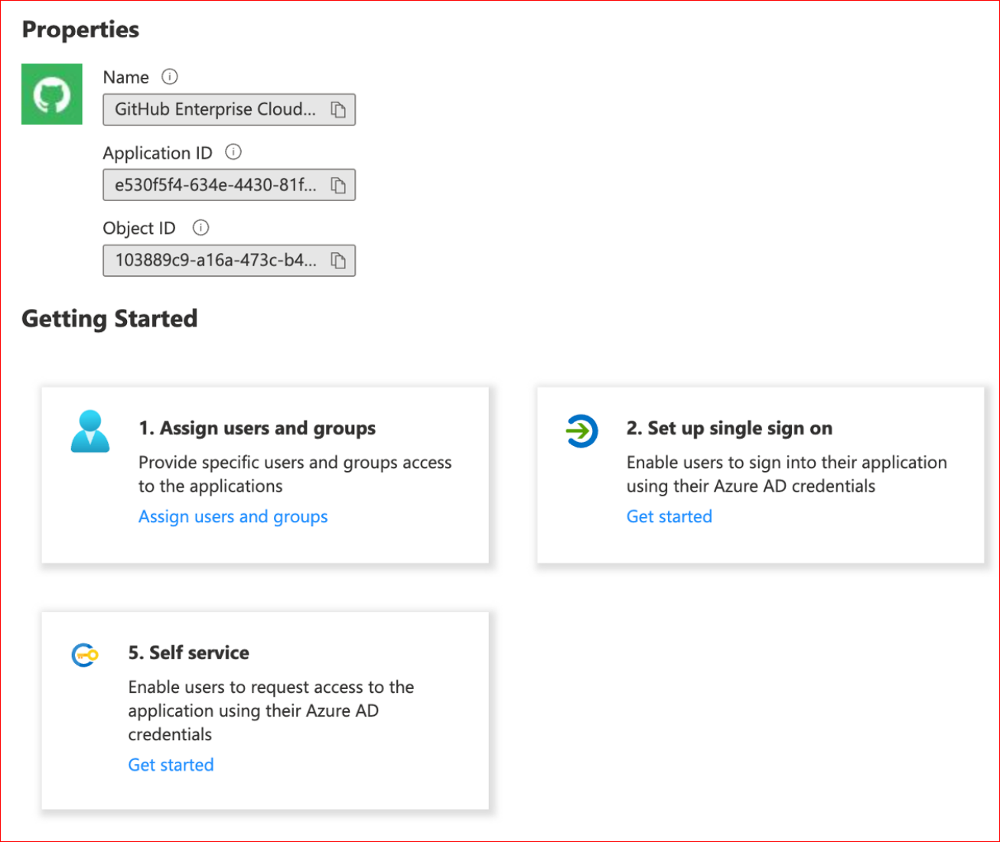

图20.10 - 配置企业应用程序

使用组织或企业的URL作为标识符。你可以使用你在图20.8中看到的URL的第一部分，仅在不包含/saml/consume的情况下使用。使用这个URL作为实体ID。将此 URL 作为实体ID。将/saml/consume添加为回复URL 和 /sso添加为登录 URL。结果应如图20.11所示：


图20.11 - AAD Enterprise应用程序中的基本SAML配置

属性和声明可用于调整AAD字段的映射。如果您的AAD没有被定制，默认设置应该有效（请参见图20.12）：

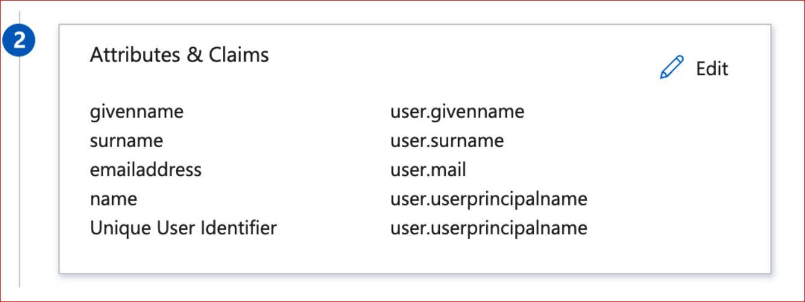

图20.12 - 配置SAML令牌的属性和声明

下载用于签署SAML令牌的Base64证书（参见图20.13）：


图20.13 - 下载SAML签名证书

复制登录URL和Azure AD标识符URL（参见图20.14）：


图20.14 - 获取登录URL和Azure AD标识符

接下来，您可以回到GitHub并填写数据。然后，将Login URL信息粘贴到Sign on URL字段中，并将Azure AD标识符URL粘贴到Issuer字段。在文本编辑器中打开证书，并将内容粘贴到Public certificate字段中。结果如图20.15所示：

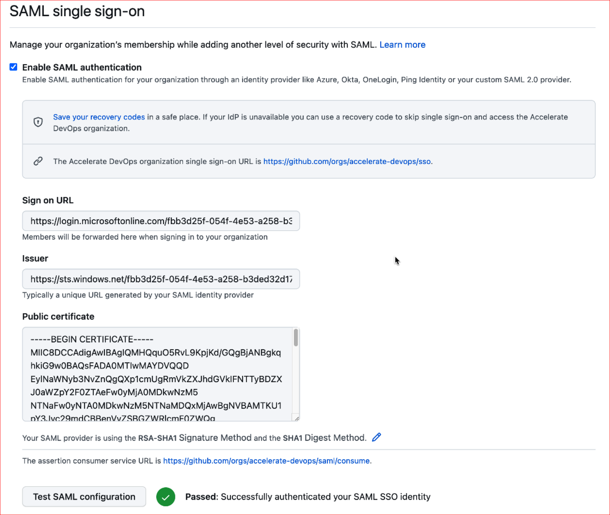

图20.15 - 在GitHub上配置SAML SSO

点击测试SAML配置，然后使用AAD凭证登录。如果一切 
顺利，你可以勾选 Require SAML authentication 来强制使用 SAML 访问。然后，GitHub将检查哪些用户没有通过IdP获得访问权限，并在确认后将其删除。

注意，只有授权的PAT令牌和SSH密钥才能访问受SSO保护的内容。每个用户必须进入其PAT令牌/SSH密钥并对其授权，如图20.16中的示例所示：

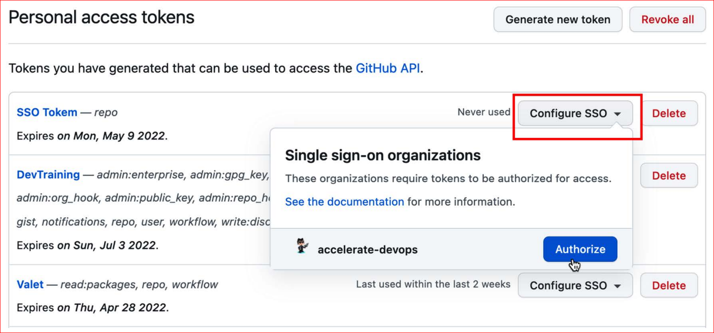

图20.16 - 为受SSO保护的组织授权PAT令牌

当然，每个 IdP 的配置都是不同的，根据您配置的是企业、组织还是服务器，数值的变化也略有不同。但通过 IdP 文档，配置起来应该简单明了。

### SCIM

启用SAML SSO后，当在IdP中停用用户时，用户不会自动移除权限。您可以在GHEC中实现SCIM，以根据您的IdP信息自动添加、管理和删除访问权限。

SCIM 是一个 API 端点（详见 https://docs.github.com/en/enterprise-cloud@latest/rest/reference/scim），可由IdP 用来管理 GitHub 中的用户。兼容的IdP包括Azure AD、Okta和OneLogin。如果 IdP 兼容，要配置SCIM必须参照 IdP 的文档。以下是配置AAD的教程：https://docs.microsoft.com/en-us/azure/active-directory/saas-apps/github-provisioning-tutorial。

> 禁用第三方访问限制
>
> 请注意，在授权IdP之前，您必须在组织设置中禁用第三方访问限制。您可以在设置|第三方访问|禁用访问限制下进行操作。

###  自动团队同步

如果您在GHEC上使用SAML SSO，你可以设置团队同步来自动将团队成员身份与你的IdP同步。目前，团队同步只支持AAD和Okta。

您可以在认证安全（/settings/security）下的组织设置中启用团队同步功能。在那里，您可以查看同步的团队数量，并跳转到过滤的审计日志以查看所有相关事件（见图20.17）。


图20.17 - 为组织启用团队同步功能

启用后，您可以创建新的团队，并从您的IdP中选择一个或多个组，与你的团队进行同步，如图20.18所示：


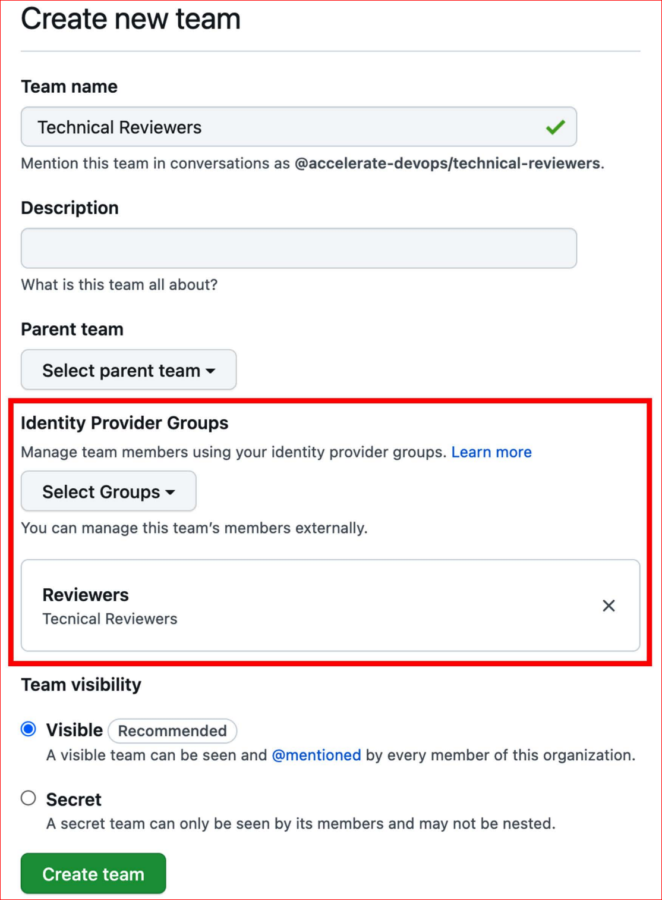

图20.18 -  利用自动同步创建团队

您可以在其他团队（父团队）内添加这些团队，但不能将嵌套组同步到GitHub。

### 企业管理用户

在GHEC中，即使你为企业或组织设置了SAML SSO，每个用户仍然需要一个GitHub.com的用户账户。GitHub的用户账户是用户的基本身份，而SAML授权是对某些企业资源的访问权限。用户可以用其身份参与开源和其他组织的活动，并且必须使用SSO进行认证才能访问企业资源。但许多组织并不希望这样。他们希望完全控制其用户的身份。企业管理用户（EMU）是这个问题的解决方案。通过EMU，用户的身份在IdP中得到完全管理。如果用户第一次使用IdP的身份登录，就会创建一个新用户。这个用户不能参与源码，也不能作为外部合作者加入其他仓库。此外，贡献只计入该用户的个人资料。

EMU为企业提供了很多身份的控制功能，但也有很多限制，如下所示：

- 用户不能在企业以外合作、加星、观察或派生仓库。他们不能创建问题或拉取请求，推送代码，评论或在这些仓库中添加反应。
- 用户仅对同一企业的其他成员可见，且他们不能关注企业外的其他用户。
- 他们不能在自己的用户账户上安装GitHub应用。
- 用户只能创建私有和内部仓库。

这些限制使很多事情变得困难。GitHub的一个主要优势是其对开源仓库的整合。但如果EMU能让您使用云服务器而非服务器实例，那么也许这种限制也许是值得的。

目前，支持EMU的IdPs是AAD和Okta。

如果您想尝试EMU，请联系GitHub的销售团队，他们将为您创建一个新的企业。

要了解更多关于EMU的信息，请参阅https://docs.github.com/en/enterprise-cloud@latest/admin/identity-and-access-management/managing-iam-with-enterprise-managed-users/about-enterprise-managed-users。

### 用GHES进行认证

在服务器上，情况有所不同。您可以为 SAML，LDAP 或 CAS 配置 SSO。配置过程相当简单，与 GHEC 差别不大。用户不需要 GitHub.com 帐户，他们可以直接使用 IdP 登录到服务器，类似于 EMU。但是如果配置了 GitHub Connect，用户可以在“用户设置” | “GitHub Connect”中连接他们的 GitHub 帐户，并与公共 GitHub 配置共享贡献数。如果选择这样做，用户可以将多个企业身份与他们的 GitHub 配置相关联。

### 审计API

GHEC和GHES都支持审计日志。日志包含所有与安全相关事件的日志条目。每个审计日志条目显示事件的相关适用信息，例如：

- 事件执行的企业或组织
- 执行事件的用户（执行者）。
- 受事件影响的用户
- 事件执行的仓库
- 执行的操作
- 事件发生的国家
- 事件发生的日期和时间

图20.19展示了GHEC中企业级别的审计日志样例。您可以搜索和筛选审计日志、选择预定义的筛选器，并点击日志条目的标题元素以创建筛选语句：

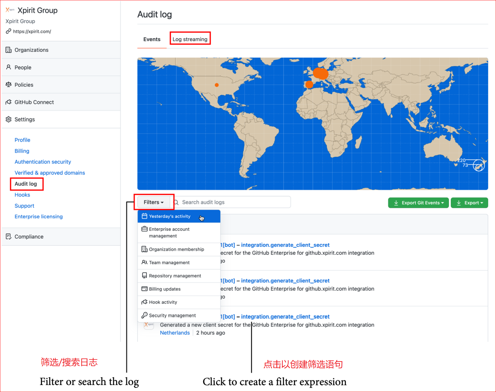

图20.19 - GHEC实例的审计日志

在GHEC上，您可以启用日志流，并配置所有事件的自动流到以下目标之一：

- 亚马逊S3 
- Azure Blob存储
- Azure事件中心
- 谷歌云存储
- Splunk

通过Azure Event Hubs，可以将事件转发到其他工具，如Log Analytics 、Sentinel。

还可以使用审计日志API访问审计日志，使用GraphQL或REST API查询审计日志。以下示例展示了如何使用REST API检索特定日期的所有事件：

  ```shell
  $ curl -H "Authorization: token TOKEN" \
  --request GET \
  "https://api.github.com/enterprises/name/auditlog?phrase=created:2022-01-01&page=1&per_page=100"
  ```

若想了解更多关于使用API查询审计日志的信息，请参阅  https://docs.github.com/en/enterprise-cloud@latest/admin/monitoring-activity-in-your-enterprise/reviewing-audit-logs-for-your-enterprise/using-the-audit-log-api-for-your-enterprise


## GitHub学习实验室  
GitHub 的一个重要优势是，大多数开发人员都已了解其工作方式。这意味着培训和引导入门的时间会更短。但当然，仍有一些新手开发人员不熟悉 GitHub。GitHub 提供了免费的 GitHub 学习实验室（https://lab.github.com）。它包含了许多使用 GitHub的问题和机器人提供的实践学习的路径，帮助您学习 GitHub。  

Microsoft Learn中也有许多免费的学习路径，如果您更喜欢这种学习方式，只需转到Microsoft Learn，并按产品筛选，选择GitHub：https://docs.microsoft.com/zh-cn/learn/browse/?products=github。


## 总结
本章介绍了 GitHub 的不同定价和托管选项、企业安全性，以及如何将 GitHub 集成到企业中。

在下一章中，我们将介绍如何将现有的源代码控制系统或 DevOps 解决方案迁移到 GitHub。


## 拓展阅读
- 价格: https://github.com/pricing 
- GitHub AE: https://docs.github.com/en/github-ae@latest/admin/overview/about-github-ae 
- SCIM: https://docs.github.com/en/enterprise-cloud@latest/rest/reference/scim 
- 企业管理用户: https://docs.github.com/en/enterprise-cloud@latest/admin/identity-and-access-management/managing-iam-with-enterprise-managed-users/about-enterprise-managed-users 
- 审计日志: https://docs.github.com/en/enterprise-cloud@latest/admin/monitoring-activity-in-your-enterprise/reviewing-audit-logs-for-your-enterprise/about-the-audit-log-for-your-enterprise 
- GitHub学习实验室: https://lab.github.com 
- 微软学习: https://docs.microsoft.com/en-us/learn 
